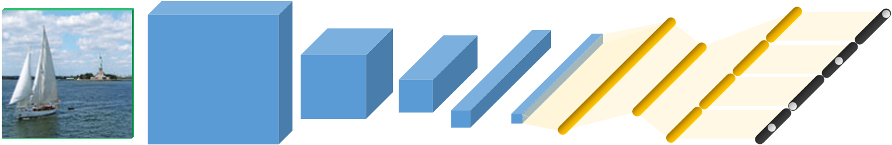

## <span style="font-variant:small-caps;">SuBiC</span>: A supervised, structured binary code for image search



**Tensorflow implementation of our paper at [ICCV 2017](http://openaccess.thecvf.com/content_iccv_2017/html/Jain_SUBIC_A_Supervised_ICCV_2017_paper.html), which proposes a supervised approach to learn highly compressed image representations.**


#### To train: 
It requires a *path_file* with paths of all training images along with their label ids. 

To train from a pre-trained base-CNN and fine-tuning only the new layers, as we do in the paper, run: 
`ipython train_subic --m 8 --k 256 --nclass 1000 --img_path path_file --pretrained trained_model --skip_last 2 --finetune 2`

Or for a full training run:
`ipython train_subic --m 8 --k 256 --nclass num_classes --img_path path_file`

Check the arguments in *train_subic.py* to try different parameters and settings. 

The *path_file* should look like,
```
path/to/imagenet/images/000001.jpg 0
path/to/imagenet/images/000002.jpg 4
```

Download a <span style="font-variant:small-caps;">SuBiC</span> model trained on ImageNet will be available soon (links will be set on this page). It has 8 layers, the first 7 layers are of VGG_M_128 with weights from [this caffe model](http://www.robots.ox.ac.uk/~vgg/software/deep_eval/releases/bvlc/VGG_CNN_M_128.caffemodel).

#### To test:

For a quick test we provide VGG\_M\_128 features for pascalvoc images with labels, download from [link available soon]. Then, add the paths of the downloaded files in *test_subic.py* and run:
`ipython test_subic trained_model VGG_M_128 --m 8 --k 256 --testset pascalvoc_features`

To test with settings we used in the paper, you need to put the path file(s) for images and labels in *test_subic.py* corresponding to their datasets.
Otherwise, directly run as:
`ipython test_subic trained_model VGG_M_128 --m 8 --k 256 --testset any_dataset --nclass num_classes --split split_size --N dataset_size --img_path path_file`

#### License 
by downloading this program, you commit to comply with the license as stated in the LICENSE.md file.

#### Contact
author: Jain Himalaya
email: see [ICCV 2017](http://openaccess.thecvf.com/content_iccv_2017/html/Jain_SUBIC_A_Supervised_ICCV_2017_paper.html) paper for email adress.


